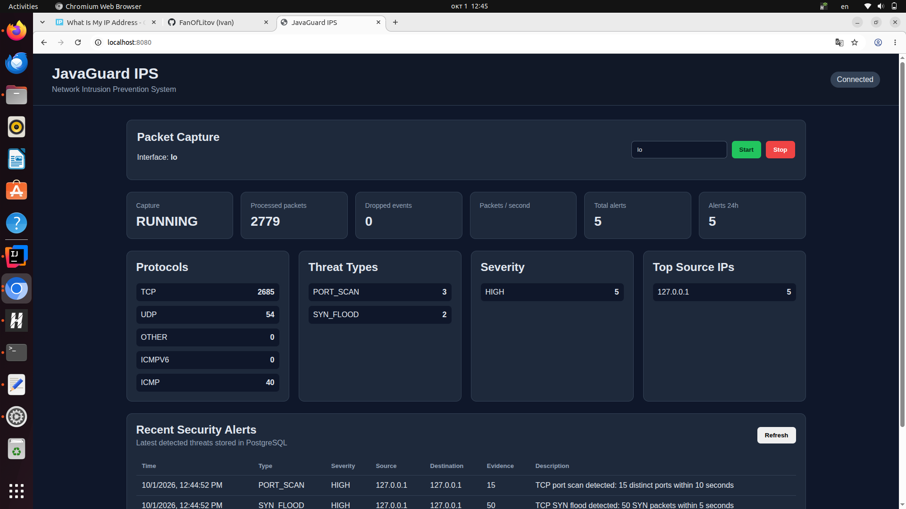
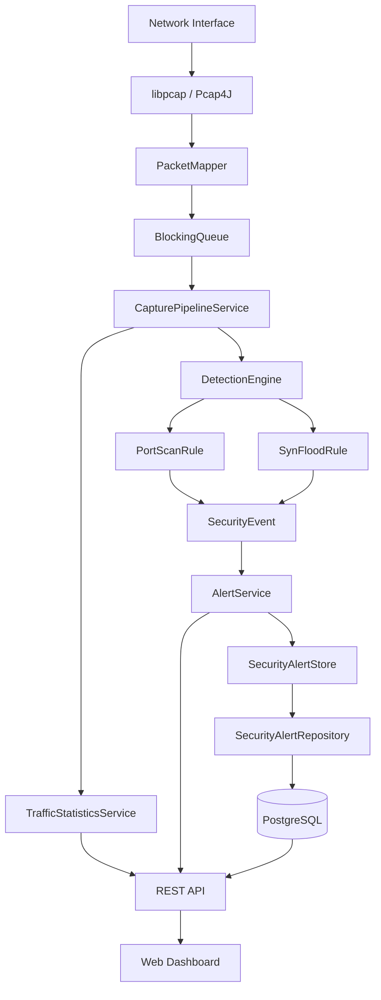

# JavaGuard IPS

**JavaGuard IPS** — учебно-практический проект сетевой системы обнаружения и предотвращения вторжений, разрабатываемый на Java и Spring Boot.

Цель проекта — пройти полный путь от низкоуровневого захвата сетевых пакетов до анализа трафика, обнаружения атак, хранения событий безопасности, построения REST API, web-dashboard и автоматического реагирования на угрозы.

На текущем этапе JavaGuard уже выполняет захват и анализ реального сетевого трафика и работает как IDS-компонент будущей IPS. Механизм активной блокировки атак будет добавлен на следующих этапах.

---

## Dashboard



Web-интерфейс отображает состояние packet capture, статистику сетевого трафика, обнаруженные угрозы и историю security events.

Dashboard автоматически получает данные через JavaGuard REST API.

---

# Возможности

На текущем этапе реализованы:

- обнаружение сетевых интерфейсов Linux;
- захват пакетов через Pcap4J/libpcap;
- анализ IPv4 и IPv6;
- анализ TCP, UDP, ICMP;
- разбор TCP-флагов SYN, ACK, RST и FIN;
- асинхронный capture pipeline;
- bounded packet queue;
- подсчёт обработанных и потерянных событий;
- статистика сетевого трафика;
- Detection Engine с подключаемыми правилами;
- обнаружение TCP Port Scan;
- обнаружение TCP SYN Flood;
- генерация SecurityEvent;
- уровни severity;
- хранение alert'ов в памяти;
- постоянное хранение событий в PostgreSQL;
- Spring Data JPA / Hibernate;
- фильтрация security events;
- пагинация истории событий;
- агрегатная статистика;
- подсчёт угроз по типам;
- подсчёт угроз по severity;
- Top Source IP;
- статистика за последние 24 часа;
- REST API;
- унифицированная обработка REST-ошибок;
- web-dashboard;
- unit tests;
- Spring integration tests;
- H2 database для тестового окружения;
- Docker Compose для PostgreSQL.

---

# Архитектура



---

# Detection Pipeline

Сетевой пакет проходит несколько этапов:

```text
Network Interface
        ↓
libpcap
        ↓
Pcap4J Packet
        ↓
PacketMapper
        ↓
NetworkEvent
        ↓
BlockingQueue
        ↓
CapturePipelineService
        ↓
DetectionEngine
        ↓
DetectionRule
        ↓
SecurityEvent
        ↓
AlertService
        ↓
PostgreSQL
```

Захват и обработка пакетов выполняются в отдельных потоках.

Для передачи событий используется ограниченная `BlockingQueue`, что позволяет контролировать ситуацию, когда скорость поступления пакетов превышает скорость анализа.

---

# Detection Engine

Каждый алгоритм обнаружения реализует общий интерфейс:

```java
public interface DetectionRule {

    Optional<SecurityEvent> analyze(NetworkEvent event);
}
```

`DetectionEngine` работает со списком `DetectionRule`.

Благодаря этому новые правила могут добавляться без изменения основного detection engine.

Текущие правила:

```text
PortScanRule
SynFloodRule
```

---

# Port Scan Detection

`PortScanRule` отслеживает TCP SYN-пакеты от одного source IP к большому количеству различных destination ports за ограниченный временной интервал.

Пример:

```text
10.0.0.10 → 10.0.0.20:20
10.0.0.10 → 10.0.0.20:21
10.0.0.10 → 10.0.0.20:22
...
```

При превышении порога создаётся:

```text
ThreatType.PORT_SCAN
Severity.HIGH
```

---

# SYN Flood Detection

`SynFloodRule` анализирует количество TCP SYN-пакетов за заданное временное окно.

В отличие от Port Scan, большое количество запросов может отправляться на один и тот же порт:

```text
10.0.0.10 → 10.0.0.20:443 SYN
10.0.0.10 → 10.0.0.20:443 SYN
10.0.0.10 → 10.0.0.20:443 SYN
...
```

После достижения порога создаётся:

```text
ThreatType.SYN_FLOOD
Severity.HIGH
```

---

# Security Events

Пример события:

```json
{
  "type": "PORT_SCAN",
  "severity": "HIGH",
  "sourceIp": "127.0.0.1",
  "destinationIp": "127.0.0.1",
  "description": "TCP port scan detected: 15 distinct ports within 10 seconds",
  "evidenceCount": 15
}
```

Security events сохраняются в PostgreSQL.

---

# PostgreSQL

JavaGuard использует PostgreSQL для хранения истории обнаруженных угроз.

Основная таблица:

```text
security_alerts
```

Поля:

```text
id
detected_at
threat_type
severity
source_ip
destination_ip
description
evidence_count
```

Для frequently queried полей используются индексы.

---

# Security Statistics

Backend умеет агрегировать данные из PostgreSQL:

```text
total alerts
alerts за последние 24 часа
alerts по ThreatType
alerts по Severity
Top Source IP
```

Пример:

```json
{
  "totalAlerts": 2,
  "alertsLast24Hours": 2,
  "byThreatType": {
    "PORT_SCAN": 1,
    "SYN_FLOOD": 1
  },
  "bySeverity": {
    "HIGH": 2
  },
  "topSourceIps": [
    {
      "sourceIp": "127.0.0.1",
      "count": 2
    }
  ]
}
```

---

# REST API

Основные endpoints:

```text
GET  /api/v1/network/interfaces

POST /api/v1/capture/start/{interface}
POST /api/v1/capture/stop
GET  /api/v1/capture/status

GET  /api/v1/statistics

GET  /api/v1/alerts
GET  /api/v1/alerts/history
GET  /api/v1/alerts/history/count
GET  /api/v1/alerts/search
GET  /api/v1/alerts/statistics

GET  /api/v1/dashboard/summary

GET  /actuator/health
```

---

# Web Dashboard

Dashboard доступен по адресу:

```text
http://localhost:8080/
```

Интерфейс отображает:

```text
Capture state
Active network interface
Processed packets
Dropped events
Packets per second
Total alerts
Alerts за 24 часа
Protocol statistics
Threat type statistics
Severity statistics
Top Source IPs
Recent Security Alerts
```

Dashboard обновляется автоматически через REST API.

---

# Технологии

Backend:

```text
Java 21
Spring Boot
Spring Web
Spring Data JPA
Hibernate
Gradle Kotlin DSL
```

Network:

```text
Pcap4J
libpcap
TCP
UDP
ICMP
IPv4
IPv6
```

Storage:

```text
PostgreSQL
H2
```

Infrastructure:

```text
Docker
Docker Compose
```

Testing:

```text
JUnit
Mockito
Spring Boot Test
```

Frontend:

```text
HTML
CSS
JavaScript
Fetch API
```

---

# Запуск PostgreSQL

```bash
docker compose up -d postgres
```

Проверка:

```bash
docker compose ps
```

В текущем development environment PostgreSQL доступен на:

```text
localhost:5434
```

---

# Сборка

```bash
./gradlew clean test bootJar
```

---

# Запуск JavaGuard

Для packet capture приложению требуются соответствующие Linux privileges.

Пример development-запуска:

```bash
sudo /path/to/java \
  -jar build/libs/javaguard-ips-0.0.1-SNAPSHOT.jar
```

---

# Demo Traffic

Для локальной демонстрации можно использовать:

```bash
./scripts/generate_demo_traffic.sh
```

Скрипт генерирует только localhost traffic и используется для development/demo:

```text
HTTP
ICMP
UDP
TCP Port Scan pattern
TCP SYN Flood pattern
```

---

# Тестирование

Запуск всех тестов:

```bash
./gradlew clean test
```

В тестовой среде используется H2 in-memory database.

Detection rules также тестируются отдельно без необходимости захвата реального сетевого трафика.

---

# Roadmap

JavaGuard планируется развивать в полноценную модульную IPS-платформу.

## Detection

Планируется добавить:

```text
ICMP Flood detection
UDP Flood detection
Connection Rate detection
Horizontal Port Scan
Vertical Port Scan
Distributed Scan detection
Brute-force behaviour detection
DNS anomaly detection
Suspicious connection detection
Stateful TCP session analysis
Configurable thresholds
Rule enable/disable
Rule priorities
```

В дальнейшем возможно добавление статистического и anomaly-based detection.

## Stateful Network Analysis

Планируется реализовать таблицу соединений:

```text
source IP
destination IP
source port
destination port
protocol
connection state
first seen
last seen
packet count
byte count
```

Это позволит анализировать не отдельные пакеты, а сетевые потоки и сессии.

## Prevention / Response Engine

Следующий крупный этап развития — переход от IDS к полноценной IPS.

Планируется:

```text
ResponseEngine
temporary IP blocking
permanent blocking
automatic unblock
block expiration
allowlist
denylist
manual block/unblock
```

Для Linux рассматривается интеграция с:

```text
nftables
```

Detection и response layers будут разделены, чтобы обнаружение угроз не зависело от конкретного firewall implementation.

## Real-time Events

Текущий dashboard использует периодический REST polling.

Планируется перейти на:

```text
WebSocket
```

Новые security events смогут сразу отправляться подключённым клиентам.

## Authentication and Authorization

Планируется Spring Security:

```text
authentication
RBAC
ADMIN
ANALYST
VIEWER
```

Отдельно будет реализован audit log действий пользователей.

## Rules Management

Планируется REST API и интерфейс для управления detection rules:

```text
enable / disable rule
threshold
time window
severity
cooldown
automatic response
```

Конфигурация правил будет храниться в PostgreSQL.

## Dashboard

Web-dashboard будет расширяться:

```text
traffic charts
alerts timeline
protocol distribution
severity distribution
threat distribution
top attackers
top attacked hosts
network interface monitoring
search and filtering
event details
rule management
block management
system health
```

В дальнейшем frontend может быть вынесен в отдельное приложение на React или другом современном frontend stack.

## Database

Планируется:

```text
Flyway migrations
alert retention policies
event pagination
advanced search
time-range queries
database indexes
traffic aggregation
historical statistics
```

## Event Architecture

По мере роста системы отдельные компоненты могут быть разделены:

```text
Capture Service
Detection Service
Alert Service
Response Service
Statistics Service
Web / API Gateway
```

Для передачи событий рассматривается event-driven architecture и Apache Kafka.

Пример будущего pipeline:

```text
Capture Service
      ↓
Kafka
      ↓
Detection Service
      ↓
Kafka
      ↓
Alert / Response Services
```

Это позволит отдельно масштабировать захват, анализ и обработку security events.

## Observability

Планируется:

```text
Spring Boot Actuator
Prometheus metrics
Grafana dashboards
structured logging
health checks
performance metrics
queue metrics
detection latency metrics
```

## Testing

Планируется расширить test infrastructure:

```text
unit tests
integration tests
repository tests
REST API tests
packet parsing tests
Testcontainers PostgreSQL
load tests
performance tests
false-positive tests
end-to-end detection tests
```

## DevOps

Планируется:

```text
Docker image
full Docker Compose environment
GitHub Actions CI
automated tests
static analysis
code quality checks
release builds
versioning
deployment documentation
```

---

# Долгосрочная цель

Итоговая цель JavaGuard — построить систему, проходящую полный security pipeline:

```text
Network Traffic
      ↓
Packet Capture
      ↓
Packet Parsing
      ↓
Flow Tracking
      ↓
Detection Engine
      ↓
Threat Correlation
      ↓
Security Event
      ↓
Persistence
      ↓
Real-time Dashboard
      ↓
Response Engine
      ↓
Firewall / nftables
```

Проект развивается как практическая площадка для изучения:

```text
Java
Spring
backend architecture
computer networks
network security
databases
concurrency
Linux
Docker
testing
event-driven systems
distributed systems
```

---

# Project Status

JavaGuard находится в активной разработке.

Текущий этап:

```text
Packet Capture        ✅
Packet Parsing        ✅
Traffic Statistics    ✅
Detection Engine      ✅
Port Scan Detection   ✅
SYN Flood Detection   ✅
Security Events       ✅
PostgreSQL Storage    ✅
Search / Pagination   ✅
Security Statistics   ✅
REST API              ✅
Initial Dashboard     ✅

Response Engine       🚧
Authentication        🚧
WebSocket             🚧
Advanced Detection    🚧
Distributed Services  🚧
```
